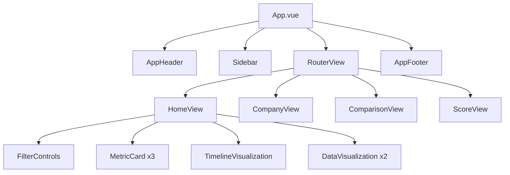
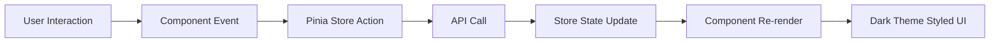
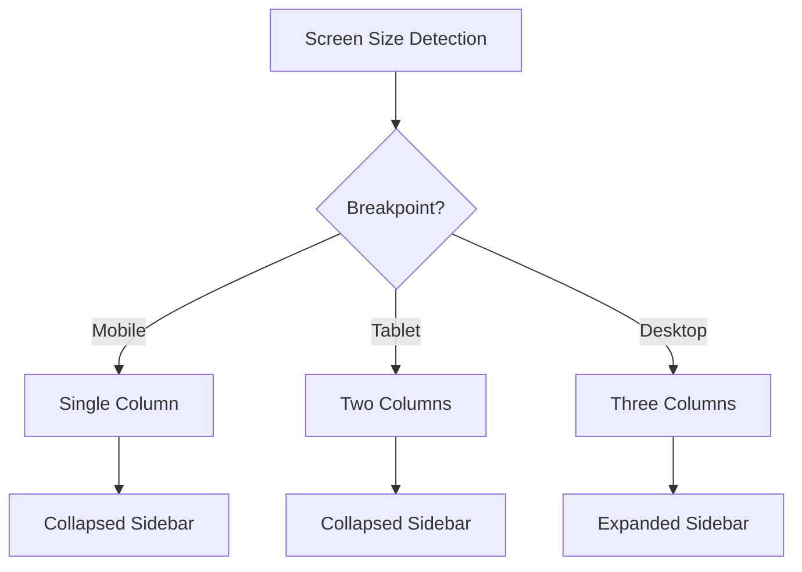

# Design Document

## Overview

This design document outlines the technical approach for redesigning the ESG Intelligence Platform UI to match the modern dark dashboard aesthetic shown in the reference image. The redesign will transform the current light-themed interface into a sophisticated dark-themed dashboard while preserving all existing functionality, state management, and business logic.

The design focuses on:
- Dark theme color system with vibrant accents
- Modern card-based layout architecture
- Enhanced navigation with pill-shaped buttons
- Advanced data visualizations (timelines, dot matrices, bubble charts)
- Responsive design patterns
- Smooth animations and transitions

## Architecture

### Design System Architecture

The redesign will implement a comprehensive design system built on top of the existing Tailwind CSS configuration:

```
Design System
├── Color Palette (Dark Theme)
│   ├── Background Colors (blacks, dark grays)
│   ├── Text Colors (whites, light grays)
│   └── Accent Colors (green, orange, blue, pink)
├── Typography System
│   ├── Font Sizes (responsive scale)
│   └── Font Weights (regular, medium, semibold, bold)
├── Spacing System (consistent padding/margins)
├── Border Radius System (rounded corners)
└── Shadow System (subtle elevations)
```

### Component Architecture

The application will maintain its existing Vue 3 component structure while updating visual styling:

```
App.vue (Dark background)
├── AppHeader.vue (Redesigned dark nav)
├── Sidebar.vue (NEW - Left action sidebar)
├── RouterView
│   ├── HomeView.vue (Dashboard layout)
│   │   ├── FilterControls.vue (NEW - Date/Product/Profile filters)
│   │   ├── MetricCard.vue (Redesigned with charts)
│   │   ├── TimelineVisualization.vue (NEW - Projects timeline)
│   │   └── DataVisualization.vue (NEW - Dot matrix & bubbles)
│   ├── CompanyView.vue (Dark theme applied)
│   ├── ComparisonView.vue (Dark theme applied)
│   └── ScoreView.vue (Dark theme applied)
└── AppFooter.vue (Dark theme applied)
```

### State Management

The existing Pinia stores will remain unchanged functionally, with additions for UI-specific state:

- **uiStore**: Extended to manage sidebar state, filter selections, and dark theme preferences
- **companyStore**: No changes (maintains existing functionality)
- **scoreStore**: No changes (maintains existing functionality)
- **indicatorStore**: No changes (maintains existing functionality)

## Components and Interfaces

### 1. Dark Theme System

**Implementation**: Extend Tailwind configuration with dark theme colors

```typescript
// tailwind.config.js extensions
theme: {
  extend: {
    colors: {
      dark: {
        bg: '#000000',           // Main background
        card: '#1a1a1a',         // Card backgrounds
        cardHover: '#222222',    // Card hover state
        border: '#333333',       // Borders
        text: {
          primary: '#ffffff',    // Primary text
          secondary: '#a0a0a0',  // Secondary text
          muted: '#666666'       // Muted text
        }
      },
      accent: {
        green: {
          light: '#c4f54d',      // Light green for positive metrics
          DEFAULT: '#a8e63d',    // Default green
          dark: '#8bc34a'        // Dark green
        },
        orange: {
          light: '#ffb74d',      // Light orange for warnings
          DEFAULT: '#ff9800',    // Default orange
          dark: '#f57c00'        // Dark orange
        },
        blue: {
          light: '#64b5f6',      // Light blue for info
          DEFAULT: '#2196f3',    // Default blue
          dark: '#1976d2'        // Dark blue
        },
        pink: {
          light: '#f48fb1',      // Light pink for highlights
          DEFAULT: '#e91e63',    // Default pink
          dark: '#c2185b'        // Dark pink
        }
      }
    }
  }
}
```

### 2. AppHeader Component (Redesigned)

**Purpose**: Modern dark navigation bar with logo, nav items, search, and user profile

**Interface**:
```typescript
interface HeaderProps {
  // No props needed - uses router for active state
}

interface HeaderEmits {
  // No emits - navigation handled by router
}
```

**Key Features**:
- Circular logo icon (left)
- Pill-shaped navigation buttons (Check Box, Monitoring, Support)
- Search icon button
- User profile with avatar and notification badge (right)
- Dark background with subtle border

**Styling**:
- Background: `bg-dark-bg border-b border-dark-border`
- Nav buttons: `bg-dark-card hover:bg-dark-cardHover rounded-full px-4 py-2`
- Active state: Subtle highlight or underline

### 3. Sidebar Component (NEW)

**Purpose**: Vertical action sidebar with quick access icons

**Interface**:
```typescript
interface SidebarProps {
  collapsed?: boolean
}

interface SidebarEmits {
  'toggle': void
  'action': (actionType: 'favorite' | 'calendar' | 'insights' | 'settings' | 'add') => void
}
```

**Key Features**:
- Fixed left position
- Icon buttons: Heart (favorites), Calendar, Diamond (insights), Settings
- Add button at bottom
- Hover effects with tooltips
- Collapsible on mobile

**Styling**:
- Background: `bg-dark-bg border-r border-dark-border`
- Icons: `text-dark-text-secondary hover:text-dark-text-primary`
- Active icon: Highlighted with accent color

### 4. FilterControls Component (NEW)

**Purpose**: Date, Product, and Profile filter dropdowns with export button

**Interface**:
```typescript
interface FilterControlsProps {
  dateOptions: string[]
  productOptions: string[]
  profileOptions: string[]
  selectedDate?: string
  selectedProduct?: string
  selectedProfile?: string
}

interface FilterControlsEmits {
  'update:selectedDate': (value: string) => void
  'update:selectedProduct': (value: string) => void
  'update:selectedProfile': (value: string) => void
  'export': void
}
```

**Key Features**:
- Three dropdown filters in horizontal row
- Print/export icon button
- Pill-shaped dark buttons with chevron icons
- Dropdown menus with dark theme

**Styling**:
- Buttons: `bg-dark-card hover:bg-dark-cardHover rounded-full px-4 py-2`
- Dropdowns: `bg-dark-card border border-dark-border rounded-lg`

### 5. MetricCard Component (Redesigned)

**Purpose**: Display KPI with percentage, trend indicator, and mini line chart

**Interface**:
```typescript
interface MetricCardProps {
  title: string
  subtitle: string
  percentage: number
  trend: 'up' | 'down'
  trendColor: 'green' | 'red'
  chartData: number[]
  chartColor: string
}
```

**Key Features**:
- Large percentage display
- Trend arrow (up/down) with color
- Category labels
- Mini line chart visualization
- Three-dot menu icon

**Styling**:
- Card: `bg-dark-card rounded-2xl p-6 hover:bg-dark-cardHover transition`
- Percentage: `text-5xl font-bold text-dark-text-primary`
- Chart: SVG line chart with smooth curves

**Chart Implementation**:
- Use existing chart libraries or custom SVG
- Smooth bezier curves
- Gradient fills optional
- Responsive to card size

### 6. TimelineVisualization Component (NEW)

**Purpose**: Horizontal timeline showing project activities over dates

**Interface**:
```typescript
interface TimelineItem {
  id: string
  date: string
  category: 'customer' | 'product' | 'web'
  value: number
  avatars?: string[]
}

interface TimelineVisualizationProps {
  items: TimelineItem[]
  dateRange: { start: string; end: string }
}
```

**Key Features**:
- Vertical date axis (left)
- Horizontal bars for projects
- Color-coded by category (green, orange, white)
- Avatar icons within bars
- Legend with totals

**Styling**:
- Container: `bg-dark-card rounded-2xl p-6`
- Bars: `rounded-full` with category colors
- Dates: `text-dark-text-secondary text-sm`

**Layout**:
- CSS Grid or Flexbox for date alignment
- Absolute positioning for bars
- Responsive scaling

### 7. DataVisualization Component (NEW)

**Purpose**: Dot matrix and bubble chart visualizations

**Interface**:
```typescript
interface DataPoint {
  id: string
  value: number
  category: 'resources' | 'valid' | 'invalid'
  x?: number
  y?: number
}

interface DataVisualizationProps {
  type: 'dotMatrix' | 'bubbleChart'
  data: DataPoint[]
  legend: { category: string; color: string; count: number }[]
}
```

**Key Features**:
- Dot Matrix: Grid of colored circles
- Bubble Chart: Varying circle sizes
- Color-coded by category
- Legend with counts
- Interactive hover states

**Styling**:
- Container: `bg-dark-card rounded-2xl p-6`
- Dots/Bubbles: SVG circles with category colors
- Legend: Horizontal layout with color indicators

**Implementation**:
- SVG-based rendering
- D3.js or custom SVG generation
- Responsive viewBox
- Smooth transitions on data updates

### 8. Responsive Layout System

**Breakpoints**:
- Mobile: < 768px
- Tablet: 768px - 1024px
- Desktop: > 1024px

**Mobile Adaptations**:
- Sidebar: Collapsible with hamburger menu
- Cards: Single column layout
- Filters: Stacked vertically or horizontal scroll
- Charts: Simplified or scrollable
- Navigation: Hamburger menu

**Grid System**:
```css
/* Desktop: 3-column grid for metric cards */
.metric-grid {
  display: grid;
  grid-template-columns: repeat(3, 1fr);
  gap: 1.5rem;
}

/* Tablet: 2-column grid */
@media (max-width: 1024px) {
  .metric-grid {
    grid-template-columns: repeat(2, 1fr);
  }
}

/* Mobile: 1-column grid */
@media (max-width: 768px) {
  .metric-grid {
    grid-template-columns: 1fr;
  }
}
```

## Data Models

No changes to existing data models. The redesign is purely visual and does not affect:
- Company types
- Indicator types
- Score types
- Report types

All existing TypeScript interfaces in `src/types/` remain unchanged.

## Error Handling

The existing error handling system remains unchanged:
- ErrorBoundary component continues to catch component errors
- Toast notifications styled with dark theme
- Error views updated with dark theme styling
- All error states maintain current functionality

**Dark Theme Error Styling**:
- Error toasts: Red accent with dark background
- Error messages: Light red text on dark background
- Error icons: Red accent color

## Testing Strategy

### Visual Regression Testing
- Screenshot comparisons for each component
- Test dark theme across all views
- Verify responsive breakpoints
- Check color contrast ratios

### Component Testing
- Existing component tests remain valid (functionality unchanged)
- Add visual snapshot tests for new components
- Test theme toggle functionality
- Verify filter controls emit correct events

### Integration Testing
- Test navigation with new header design
- Verify sidebar interactions
- Test filter combinations
- Ensure data visualizations render correctly

### Accessibility Testing
- WCAG 2.1 AA compliance for color contrast
- Keyboard navigation for all interactive elements
- Screen reader compatibility
- Focus indicators visible on dark backgrounds

### Browser Testing
- Chrome, Firefox, Safari, Edge
- Mobile browsers (iOS Safari, Chrome Mobile)
- Test CSS Grid and Flexbox support
- Verify SVG rendering

### Performance Testing
- Measure animation frame rates (target: 60fps)
- Test with large datasets in visualizations
- Monitor bundle size impact
- Lazy load heavy visualization components

## Implementation Notes

### Phase 1: Foundation
1. Update Tailwind config with dark theme colors
2. Create base dark theme CSS utilities
3. Update global styles in main.css

### Phase 2: Core Components
1. Redesign AppHeader
2. Create Sidebar component
3. Update card styling globally

### Phase 3: Visualizations
1. Create FilterControls component
2. Redesign MetricCard with charts
3. Create TimelineVisualization component
4. Create DataVisualization component

### Phase 4: Views & Polish
1. Update all view components with dark theme
2. Add animations and transitions
3. Implement responsive behaviors
4. Accessibility audit and fixes

### Migration Strategy
- All changes are additive (no breaking changes)
- Existing functionality preserved
- Theme can be toggled (optional: add light/dark toggle)
- Gradual rollout possible (component by component)

## Diagrams

### Component Hierarchy


### Data Flow


### Responsive Layout Flow


This design maintains all existing functionality while transforming the visual presentation to match the modern dark dashboard aesthetic. The implementation will be incremental, testable, and fully backward compatible.
